# Demo FinancialBot - Panduan Lengkap Fitur

Dokumentasi ini menampilkan semua fitur FinancialBot melalui screenshot dari Discord. Bot ini adalah asisten keuangan berbasis AI yang menggunakan bahasa Indonesia untuk membantu pengguna mengelola keuangan pribadi mereka.

## Daftar Isi

1. [Setup & Bantuan](#1-setup--bantuan)
2. [Pencatatan Pemasukan](#2-pencatatan-pemasukan)
3. [Pencatatan Pengeluaran](#3-pencatatan-pengeluaran)
4. [Cek Saldo](#4-cek-saldo)
5. [Laporan Keuangan](#5-laporan-keuangan)
6. [Saran Budget](#6-saran-budget)
7. [Analisis Pembelian](#7-analisis-pembelian)
8. [Pencarian Harga Web & Analisis](#8-pencarian-harga-web--analisis)
9. [Analisis Tren Pengeluaran](#9-analisis-tren-pengeluaran)
10. [Fitur Export Data](#10-fitur-export-data)
11. [Fitur Reminder](#11-fitur-reminder)
12. [Manajemen Transaksi](#12-manajemen-transaksi)
13. [Percakapan Natural](#13-percakapan-natural)
14. [Percakapan Multi-turn](#14-percakapan-multi-turn)
15. [Error Handling](#15-error-handling)
16. [Skenario Kompleks](#16-skenario-kompleks)
17. [Hasil Test Suite](#17-hasil-test-suite)

---

## 1. Setup & Bantuan

### Menampilkan Menu Bantuan

Bot menyediakan menu bantuan lengkap yang menjelaskan semua fitur yang tersedia. Pengguna cukup mengetik `help` atau bertanya "apa saja yang bisa kamu lakukan?" untuk melihat daftar fitur.

**Perintah:** `help` atau `apa saja yang bisa kamu lakukan?`

**Fitur yang ditampilkan:**
- Manajemen Transaksi (catat pemasukan, pengeluaran, hapus transaksi)
- Laporan & Analisis (cek saldo, laporan keuangan, analisis tren, saran budget)
- Belanja & Pencarian Harga (pencarian harga web, analisis pembelian)
- Export Data (CSV, Excel)
- Reminder (buat, lihat, selesaikan)
- Percakapan natural tentang keuangan

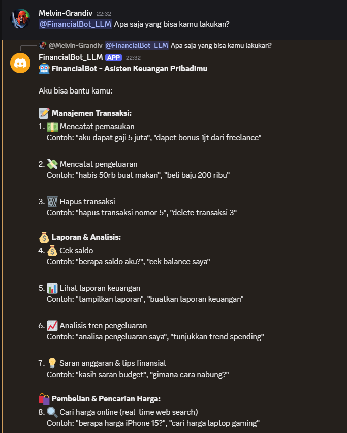

*Bagian pertama dari menu bantuan menampilkan daftar lengkap fitur utama bot*

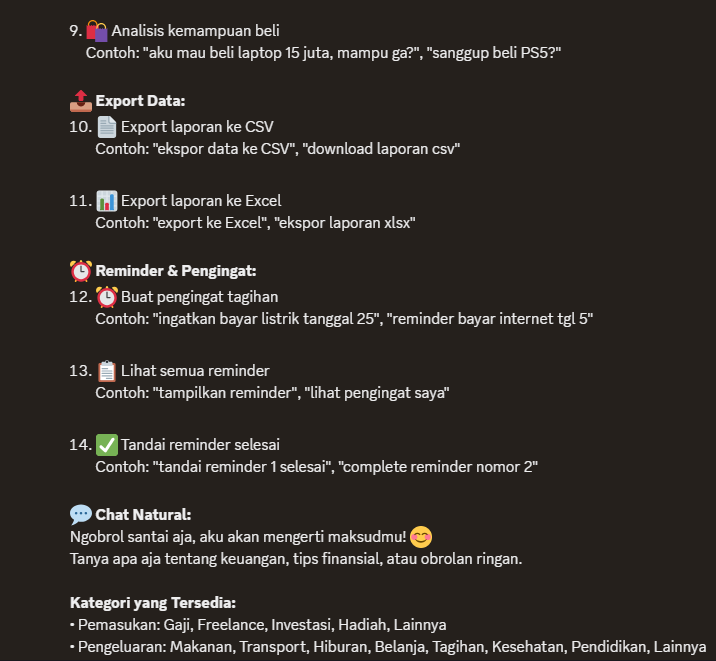

*Bagian kedua menampilkan kategori pemasukan dan pengeluaran yang tersedia*

---

## 2. Pencatatan Pemasukan

### Mencatat Gaji

Bot dapat mencatat pemasukan dari berbagai sumber dengan otomatis mengekstrak jumlah, kategori, dan deskripsi dari input bahasa natural.

**Perintah:** `saya dapat gaji 5000000 dari pekerjaan utama`

**Hasil:**
- Jumlah: Rp 5.000.000
- Kategori: Gaji
- Deskripsi: pekerjaan utama

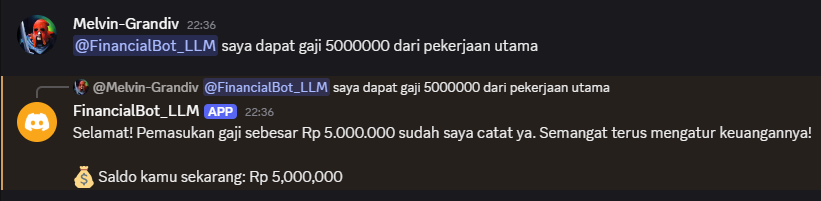

*Bot berhasil mencatat pemasukan gaji dengan konfirmasi detail transaksi*

### Mencatat Pemasukan Freelance

**Perintah:** `dapat uang freelance 2000000 dari project web`

**Hasil:**
- Jumlah: Rp 2.000.000
- Kategori: Freelance
- Deskripsi: project web

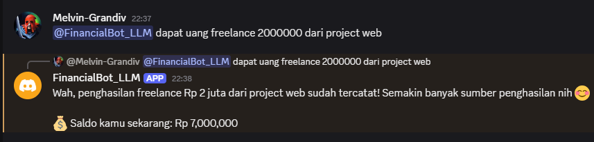

*Pencatatan pemasukan dari pekerjaan freelance dengan kategori yang sesuai*

---

## 3. Pencatatan Pengeluaran

Bot mendukung berbagai kategori pengeluaran dan dapat memahami konteks dari input natural.

### Pengeluaran Makanan

**Perintah:** `beli makan siang di restoran 150000`

**Kategori:** Makanan

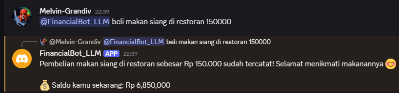

*Pencatatan pengeluaran untuk makanan dengan detail lengkap*

### Pengeluaran Transportasi

**Perintah:** `bayar grab 50000 untuk ke kantor`

**Kategori:** Transport

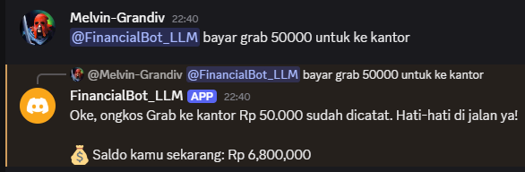

*Pencatatan biaya transportasi online ke kantor*

### Pengeluaran Hiburan

**Perintah:** `nonton bioskop 75000`

**Kategori:** Hiburan

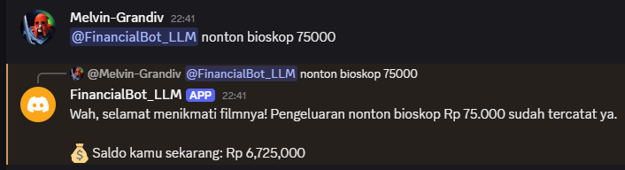

*Pencatatan pengeluaran untuk hiburan seperti nonton film*

### Pengeluaran Tagihan

**Perintah:** `bayar listrik bulan ini 500000`

**Kategori:** Tagihan

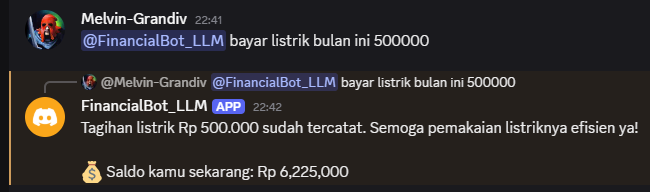

*Pencatatan pembayaran tagihan listrik bulanan*

---

## 4. Cek Saldo

Bot dapat menampilkan ringkasan saldo terkini dengan detail total pemasukan, pengeluaran, dan saldo akhir.

**Perintah:** `cek saldo saya` atau `berapa saldo saya sekarang?`

**Informasi yang ditampilkan:**
- Total pemasukan
- Total pengeluaran
- Saldo saat ini
- Ringkasan per kategori

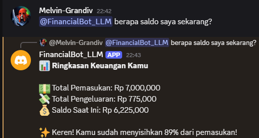

*Ringkasan saldo lengkap dengan breakdown pemasukan dan pengeluaran*

---

## 5. Laporan Keuangan

Menghasilkan laporan keuangan detail yang mencakup semua transaksi, breakdown per kategori, dan analisis.

**Perintah:** `buatkan laporan keuangan saya`

**Isi laporan:**
- Ringkasan pemasukan per kategori
- Ringkasan pengeluaran per kategori
- Daftar transaksi lengkap dengan ID
- Total dan saldo

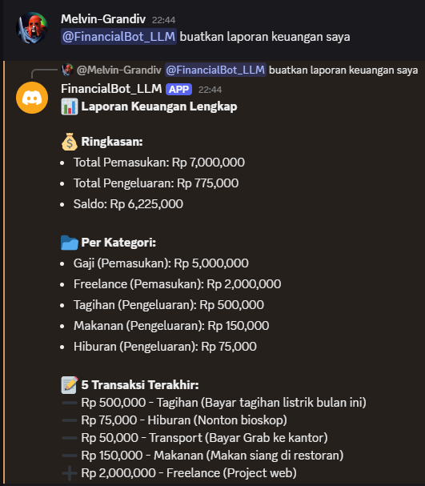

*Laporan keuangan komprehensif dengan semua detail transaksi*

---

## 6. Saran Budget

Bot menggunakan AI untuk menganalisis pola keuangan pengguna dan memberikan saran budget yang dipersonalisasi.

**Perintah:** `berikan saran budget untuk saya`

**Saran yang diberikan:**
- Rekomendasi alokasi budget
- Analisis pola pengeluaran
- Tips penghematan
- Target tabungan

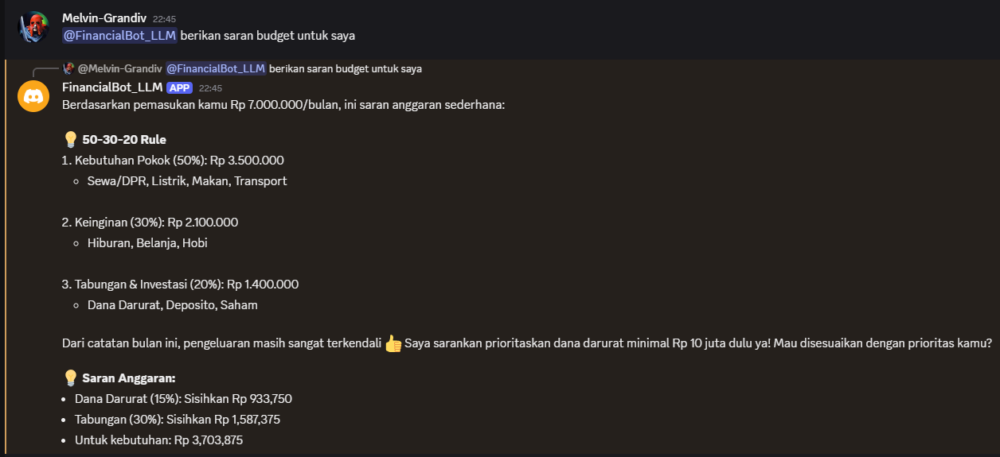

*Saran budget AI yang dipersonalisasi berdasarkan riwayat transaksi pengguna*

---

## 7. Analisis Pembelian

Bot dapat menganalisis apakah pengguna mampu membeli suatu barang berdasarkan saldo dan pola keuangan mereka.

**Perintah:** `saya mau beli laptop 15 juta, apakah saya mampu?`

**Analisis mencakup:**
- Penilaian kemampuan beli
- Dampak terhadap saldo
- Rekomendasi dan pertimbangan
- Saran alternatif jika perlu

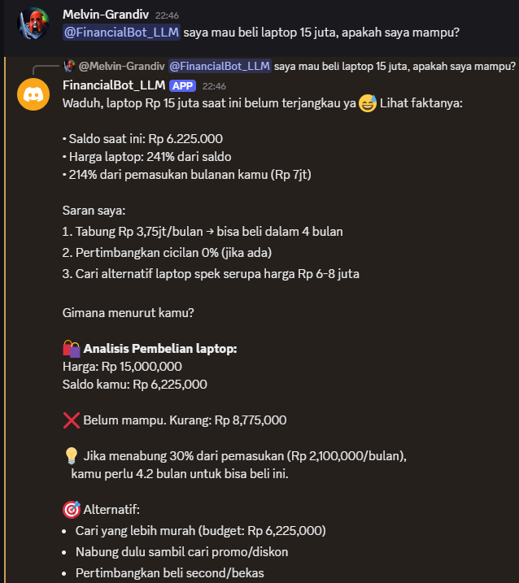

*Analisis kemampuan beli laptop senilai 15 juta dengan rekomendasi detail*

---

## 8. Pencarian Harga Web & Analisis

### Pencarian Harga Real-time

Bot terintegrasi dengan web search untuk mencari harga barang secara real-time dari internet.

**Perintah:** `berapa harga iPhone 15 sekarang?`

**Fitur:**
- Pencarian web real-time menggunakan MCP server
- Informasi harga dari berbagai sumber
- Harga pasar Indonesia
- Waktu respons 15-30 detik

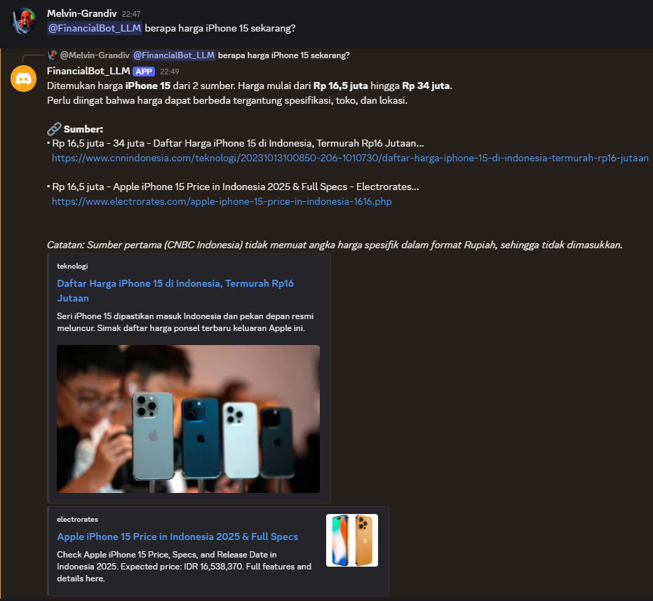

*Hasil pencarian harga iPhone 15 dari web dengan informasi harga aktual*

### Analisis Pembelian dengan Web Search

Bot dapat menggabungkan pencarian harga web dengan analisis kemampuan beli secara otomatis.

**Perintah:** `apakah saya mampu beli iPhone 15?`

**Proses:**
1. Bot mencari harga iPhone 15 di web
2. Menganalisis kemampuan beli berdasarkan saldo
3. Memberikan rekomendasi

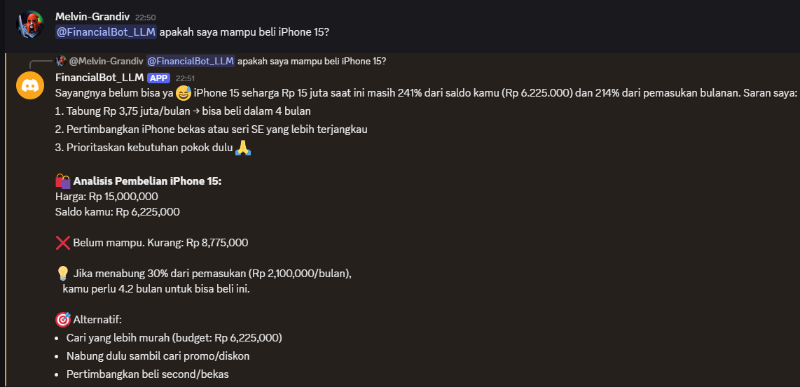

*Kombinasi pencarian harga web dan analisis kemampuan beli dalam satu respons*

### Web Search lalu Purchase Analysis

**Perintah:** Pertama mencari harga, lalu analisis pembelian

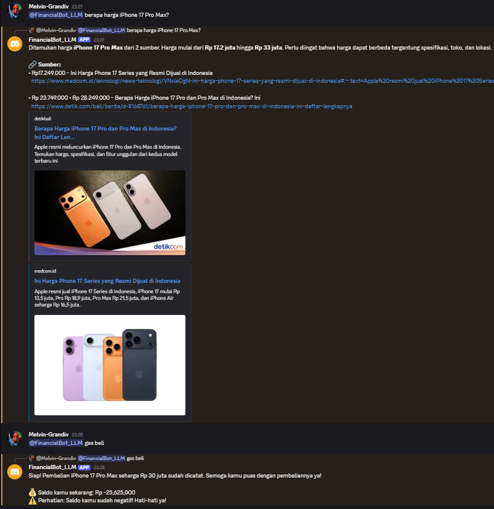

*Alur lengkap dari pencarian harga hingga analisis pembelian*

---

## 9. Analisis Tren Pengeluaran

Bot menggunakan pandas untuk menganalisis pola pengeluaran dan memberikan insight mendalam.

**Perintah:** `analisa pengeluaran saya` atau `tunjukkan trend spending saya`

**Insight yang diberikan:**
- Tren pengeluaran bulanan
- Top 5 kategori dengan persentase
- Pola dan insight pengeluaran
- Rekomendasi berdasarkan tren

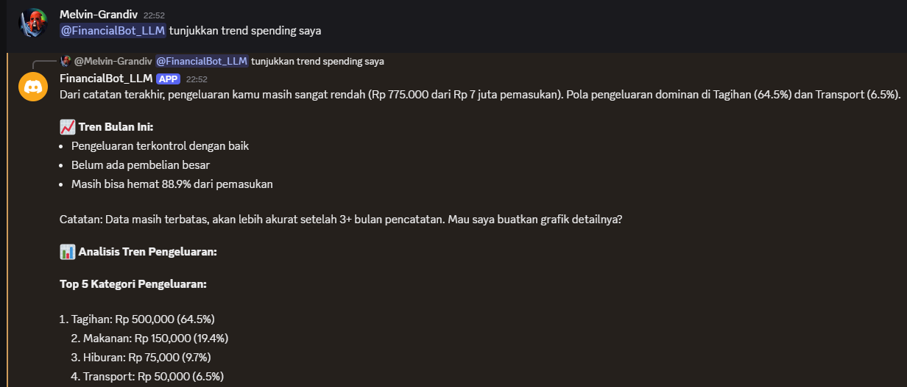

*Analisis tren pengeluaran dengan breakdown kategori dan insight*

---

## 10. Fitur Export Data

Bot menyediakan fitur export data transaksi ke format CSV dan Excel untuk analisis lebih lanjut.

### Export ke CSV

**Perintah:** `export data saya ke CSV`

**Hasil:**
- File CSV tersimpan di folder `exports/`
- Format: `financial_report_user{id}_{date}.csv`
- Berisi semua transaksi

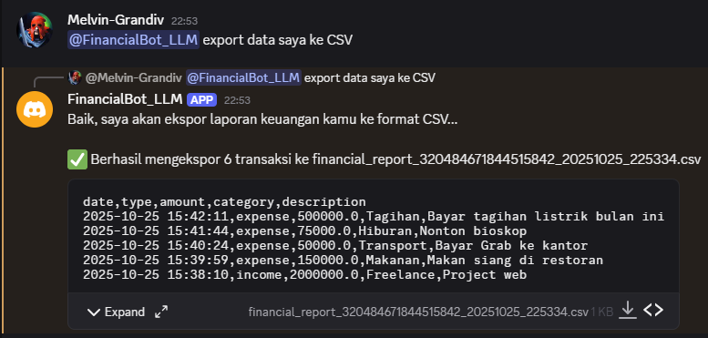

*Konfirmasi export data ke format CSV dengan path file*

### Export ke Excel

**Perintah:** `export ke Excel`

**Hasil:**
- File Excel dengan 3 sheet:
  1. Transactions - Daftar semua transaksi
  2. Summary - Ringkasan keuangan
  3. Categories - Breakdown per kategori

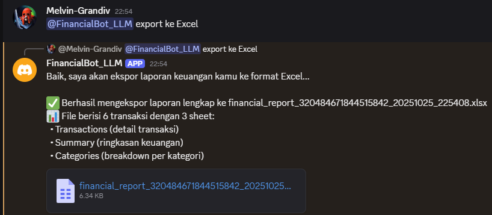

*Konfirmasi export data ke format Excel dengan multi-sheet*

### Tampilan File Excel

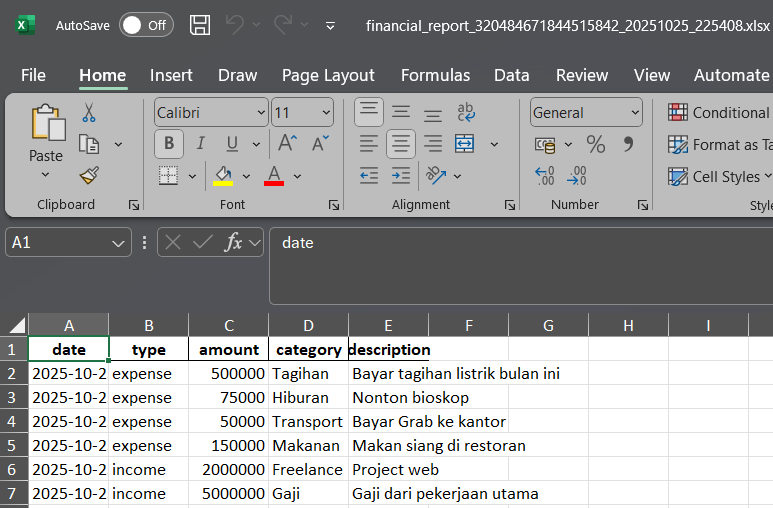

*Preview file Excel yang diexport menampilkan sheet Transactions dengan data lengkap*

---

## 11. Fitur Reminder

Bot menyediakan sistem reminder untuk membantu pengguna mengingat pembayaran tagihan atau target budget.

### Membuat Reminder (Tanggal Saja)

**Perintah:** `ingatkan saya bayar internet tanggal 25`

**Fitur:**
- Otomatis kalkulasi bulan berikutnya jika tanggal sudah lewat
- ID reminder untuk tracking
- Status aktif/selesai

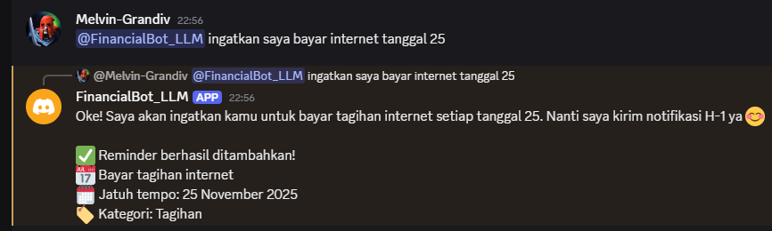

*Pembuatan reminder untuk bayar internet dengan tanggal 25*

### Membuat Reminder (Tanggal Lengkap)

**Perintah:** `buatkan reminder bayar kartu kredit tanggal 2025-11-15`

**Format:** YYYY-MM-DD atau DD saja

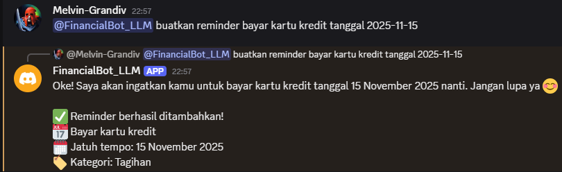

*Reminder dengan format tanggal lengkap untuk pembayaran kartu kredit*

### Melihat Semua Reminder

**Perintah:** `tampilkan semua reminder saya`

**Informasi:**
- Daftar semua reminder aktif
- ID, deskripsi, dan tanggal jatuh tempo
- Status (aktif/selesai)

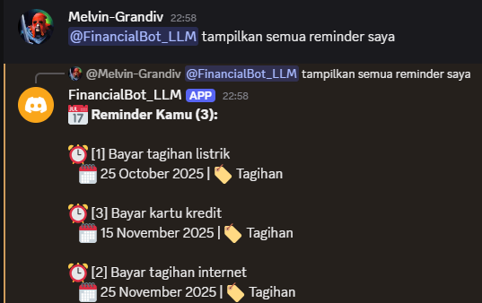

*Daftar lengkap semua reminder dengan detail dan status*

### Menyelesaikan Reminder

**Perintah:** `tandai reminder 1 sudah selesai`

**Hasil:**
- Reminder ditandai sebagai completed
- Konfirmasi penyelesaian

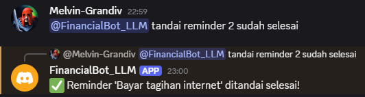

*Konfirmasi penyelesaian reminder dengan ID tertentu*

---

## 12. Manajemen Transaksi

### Melihat Daftar Transaksi

Bot menampilkan daftar transaksi dengan ID untuk keperluan manajemen.

**Perintah:** `tampilkan transaksi saya` atau `buatkan laporan keuangan`

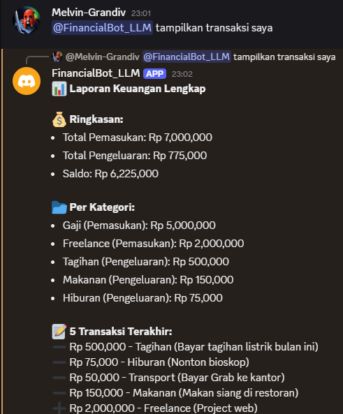

*Daftar transaksi lengkap dengan ID untuk referensi*

### Menghapus Transaksi

**Perintah:** `hapus transaksi nomor 3`

**Hasil:**
- Transaksi dihapus dari database
- Konfirmasi penghapusan
- Saldo otomatis update

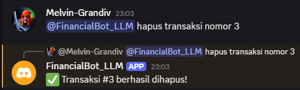

*Konfirmasi penghapusan transaksi berdasarkan ID*

---

## 13. Percakapan Natural

Bot dapat melakukan percakapan natural tentang topik keuangan dan memberikan tips yang berguna.

**Perintah:** `halo apa kabar?` atau `tips menabung yang baik dong`

**Kemampuan:**
- Memahami konteks percakapan
- Memberikan saran keuangan umum
- Respons yang natural dan friendly

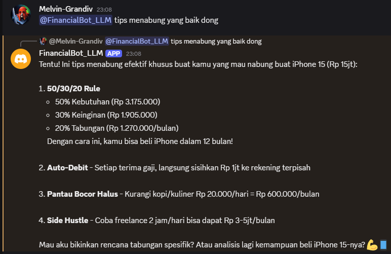

*Percakapan natural dengan bot tentang tips menabung*

---

## 14. Percakapan Multi-turn

Bot memiliki memory percakapan yang memungkinkan follow-up questions dengan mempertahankan konteks.

**Perintah:**
1. `saya mau nabung 10 juta dalam 6 bulan`
2. `bagaimana caranya?` (follow-up)

**Fitur:**
- Memory 5 percakapan terakhir per user
- Memahami konteks pertanyaan sebelumnya
- Respons yang relevan dengan konteks

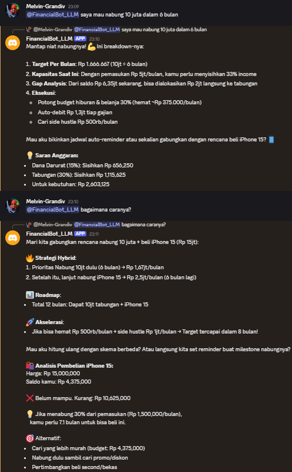

*Percakapan multi-turn yang menunjukkan bot mengingat konteks sebelumnya*

---

## 15. Error Handling

Bot dapat menangani input yang tidak valid dengan memberikan respons yang sopan dan meminta klarifikasi.

**Perintah:** `saya dapat gaji banyak banget`

**Hasil:**
- Pesan error yang informatif
- Permintaan klarifikasi
- Panduan input yang benar

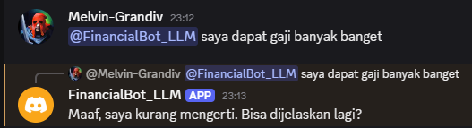

*Error handling untuk input jumlah yang tidak valid*

---

## 16. Skenario Kompleks

### Analisis Pembelian Kompleks

Bot dapat menganalisis skenario pembelian yang lebih kompleks seperti cicilan.

**Perintah:** `saya mau beli motor 30 juta dengan cicilan 3 juta per bulan, apakah saya mampu?`

**Analisis:**
- Kemampuan membayar uang muka
- Kemampuan cicilan bulanan
- Dampak jangka panjang
- Rekomendasi detail

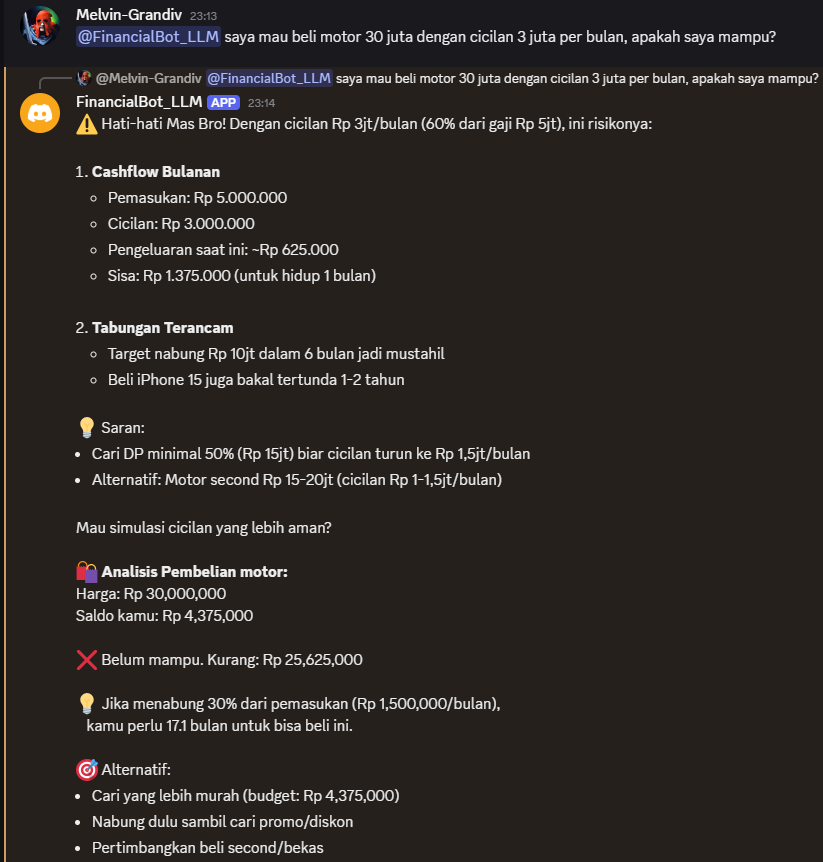

*Analisis pembelian kompleks dengan cicilan dan pertimbangan jangka panjang*

---

## 17. Hasil Test Suite

Bot memiliki test suite komprehensif yang memastikan semua fitur bekerja dengan baik.

**Test Coverage:**
- Database Manager (9 tests)
- Integration Tests (10 tests)
- LLM Agent Tests (17 tests)
- MCP Manager Tests (17 tests)

**Total:** 53 test cases, semua PASSED ✅

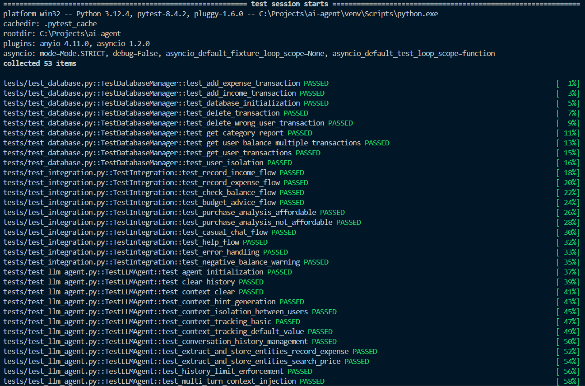

*Hasil test suite bagian 1 menampilkan tests untuk database, integration, dan LLM agent*

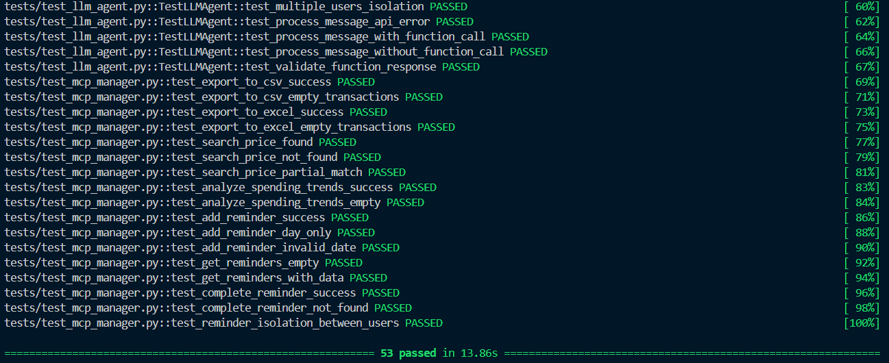

*Hasil test suite bagian 2 menampilkan tests untuk MCP manager dengan 100% pass rate*

**Waktu eksekusi:** 13.86 detik untuk 53 tests

**Test categories:**
- ✅ Database operations (transaksi, saldo, kategori)
- ✅ Integration flows (record, check, analysis)
- ✅ LLM agent (context tracking, function calling, history management)
- ✅ MCP features (export, search, analytics, reminders)

---

## Teknologi yang Digunakan

- **LLM Integration:** OpenRouter API (Claude, GPT, Llama)
- **Database:** SQLite
- **Analytics:** pandas + openpyxl
- **Web Search:** web-search-mcp server (Playwright-based)
- **Interface:** Discord.py atau CLI
- **Language:** Python 3.12+

## Kategori yang Tersedia

**Pemasukan:**
- Gaji
- Freelance
- Investasi
- Hadiah
- Lainnya

**Pengeluaran:**
- Makanan
- Transport
- Hiburan
- Belanja
- Tagihan
- Kesehatan
- Pendidikan
- Lainnya

---

## Cara Menjalankan Bot

```bash
# Mode Discord (memerlukan DISCORD_TOKEN)
python bot.py

# Mode CLI untuk testing (tanpa Discord)
python cli_runner.py
```

## Environment Variables

Diperlukan:
- `OPENROUTER_API_KEY` - API key untuk OpenRouter
- `DISCORD_TOKEN` - Token bot Discord (hanya untuk mode Discord)

Optional:
- `OPENROUTER_MODEL` - Model yang digunakan (default: anthropic/claude-3-haiku)
- `DATABASE_PATH` - Path database SQLite (default: financial_bot.db)
- `WEB_SEARCH_MCP_PATH` - Path ke web-search-mcp server

---

## Keunggulan FinancialBot

1. **Natural Language Processing** - Memahami bahasa Indonesia natural
2. **Multi-user Support** - Isolasi data per pengguna
3. **Conversation Memory** - Mengingat konteks percakapan
4. **Real-time Web Search** - Pencarian harga aktual dari web
5. **AI-powered Insights** - Saran budget dan analisis berbasis AI
6. **Data Export** - Export ke CSV dan Excel
7. **Reminder System** - Pengingat tagihan dan target
8. **Comprehensive Testing** - 53 test cases dengan 100% pass rate

---

**Dokumentasi lengkap:** Lihat `DEMO_INSTRUCTIONS.md` untuk panduan pengambilan screenshot dan testing.

**Repository:** FinancialBot - AI-powered Financial Assistant in Indonesian
